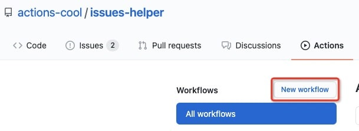
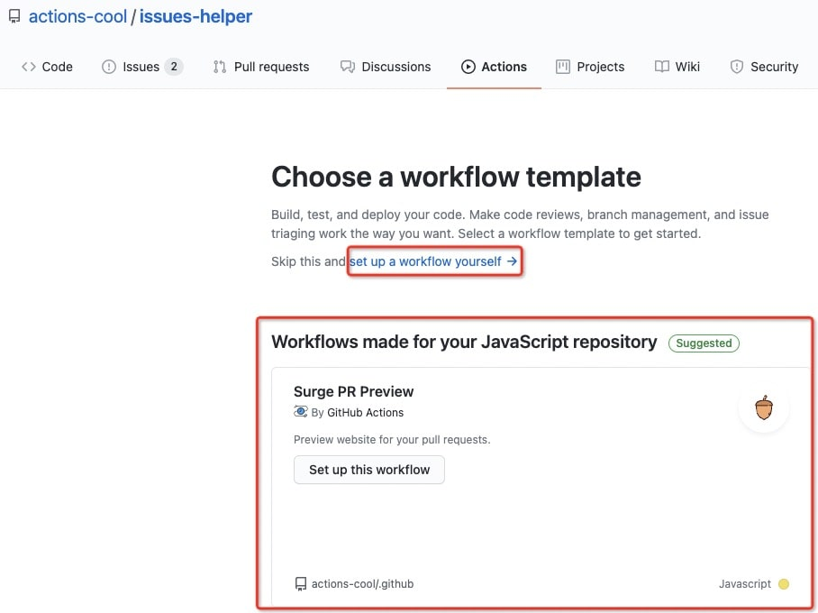

## 🚀 GitHub Actions 快速入门

如何快速在现有仓库中添加 GitHub Action 工作流？

### a. 新建 Action

点击仓库的 Actions，若已增加过 Actions，会显示如下界面。



点击 `New workflow` 新增。



<Alert type="success">
你可以点击 <Badge>set up a workflow yourself</Badge> 新增一个自定义 action，也可以根据模板来套用新增一个 action。<a target="_blank" href="https://github.com/actions-cool/.github">模板使用</a>。
</Alert>

### b. 编写 Action

Actions 存放地址是固定的，统一为 `/.github/workflows/xx.yml`。关于 `YML` 语法，可自行学习。

点你点击新增自定义 Action 时，默认展示：

```yml
# 这是一个基本的工作流程，可帮助你快速开始

name: CI

# 控制这个工作流啥时候触发
on:
  # 当前设置为：推送 main 分支或对 main 分支的 PR
  push:
    branches: [ main ]
  pull_request:
    branches: [ main ]

  # 允许从 Actions 选项卡手动运行此工作流
  workflow_dispatch:

# 顺序或并行开始执行一个或多个作业流
jobs:
  # 当前工作流只包含一个名为 build
  build:
    # 运行环境
    runs-on: ubuntu-latest

    # 工作流步骤
    steps:
      # 在当前工作流环境，检出当前库
      - uses: actions/checkout@v2

      # 执行一条 shell 命令
      - name: Run a one-line script
        run: echo Hello, world!

      # 执行多条 shell 命令
      - name: Run a multi-line script
        run: |
          echo Add other actions to build,
          echo test, and deploy your project.
```
- `name`：自定义 Action 流程名称
- `on`：Action 触发机制，参考
- `uses`：使用其他 GitHub Action

### c. 触发 Action

当你完成编写完成提交到主分支后，即可自动启用该 workflow，触发条件遵循 on 的定义。

### d. 查看 Action 记录

- 在仓库主页面中，点击 <Badge>Actions</Badge>
- 在左侧边栏中，单击您想要查看的工作流程名称
- 从工作流程运行列表中，单击要查看的运行的名称
- 任何失败的步骤都可以展开查看结果